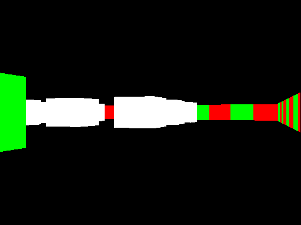

# Raycaster
Raycasting is a rendering technique to create a 3D perspective using a 2D map. 
Older games like Doom and Wolfenstein3D are known games made using this technique. 
The basics of how the technique works is that a ray for every pixel in the width of the 
screen is sent out from the cameras position until it hits a square that is representing 
a wall. If it hits a wall then the distance is calculated and a line is drawn to the screen 
with the height depending on the distance.

# References
Here are some useful resources used while building this application.

* [http://lodev.org/cgtutor/raycasting.html](http://lodev.org/cgtutor/raycasting.html)

# License
This project is maintained under the MIT License.
